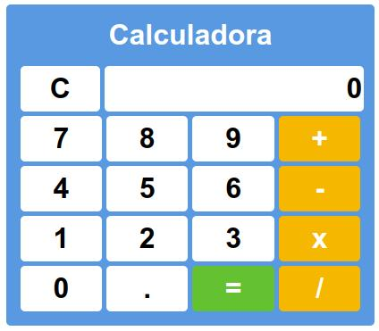

# Calculadora




> Calculadora simples e funcional feita em <a href="https://angular.io/">🔗 Angular</a>.

## 🚀 Instalando calculadora

Para instalar o calculadora, siga estas etapas:

Linux, macOS e Windows:
```
yarn install
```
```
ng serve
```

## 📫 Contribuindo para calculadora  

Para contribuir com a calculadora, siga estas etapas:

1. Bifurque este repositório.
2. Crie um branch: `git checkout -b <nome_branch>`.
3. Faça suas alterações e confirme-as: `git commit -m '<mensagem_commit>'`
4. Envie para o branch original: `git push origin calculadora / <local>`
5. Crie a solicitação de pull.
